<p align="center">
  
  
</p>

# ZoneCast — PA / intercom system over IP

[](https://github.com/ZampyZampy/ZoneCast/actions/workflows/tests.yml)
[](LICENSE)

Web application for managing a PA/intercom sound system built on IP
speakers, designed to stay brand-agnostic — a dropdown with the most
common multicast-paging brands (Fanvil, Algo, CyberData, Grandstream,
Axis, Tiptel, Akuvox) plus a free-text "Other" option. Lets you
register speakers, group them into zones, upload audio files, play
them on demand, and schedule them over time with a per-country holiday
calendar.

<p align="center">
  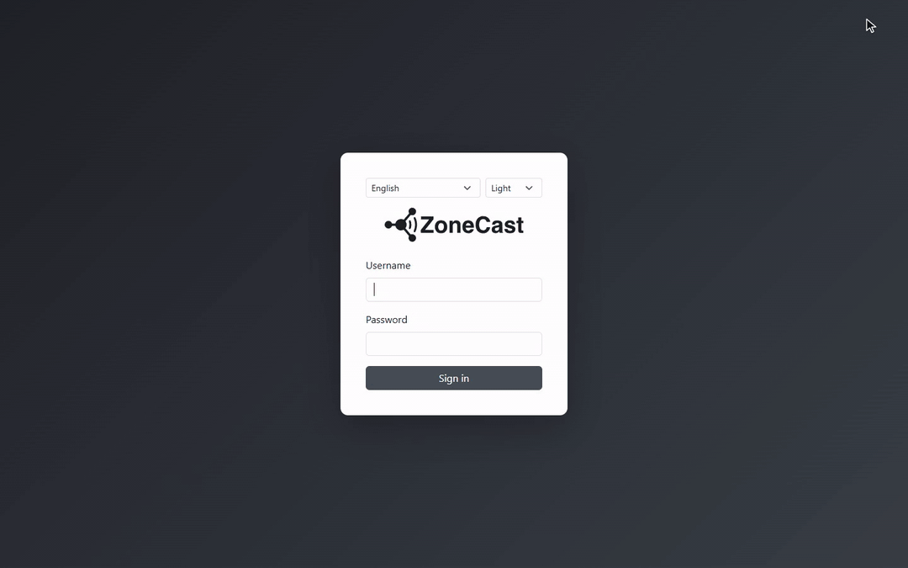
</p>
<p align="center"><sub>Sign in → play a file to a zone → speakers, zones, schedules, media → dark theme → Italian / Japanese · <a href="docs/readme/tour.mp4">MP4 version</a></sub></p>

## Key features

- **Multicast RTP playback** to zones, single speakers, or the whole
  fleet, with a playback history.
- **Recurring schedules** with a per-country holiday calendar (Italy,
  United States, United Kingdom, France, Germany, Spain, Japan, China)
  — exclude holidays, always include them, or play only on holidays.
- **Automatic audio analysis** of uploaded files, with a warning when
  bass is dominant (not ideal for PA horns) and a suggested gain
  amplification when there's headroom before clipping.
- **Automatic provisioning** for supported devices (see section 2) and
  backup/restore of their configuration.
- **Two user roles**: admin (full access, including the
  Users/System/Logs/Backup archive sections, plus direct device
  actions like "Apply now" and "Backup") and operator (playback,
  managing speakers/zones/media/schedules).
- **Optional per-user 2FA** (TOTP + recovery codes), **full
  export/import** of the installation (database, media, device
  backups, encryption key) for migrating between machines.
- **System panel** (admin only): network (IP/DNS/gateway with a trial
  period), time/NTP, host resource monitoring (disk/RAM/CPU),
  changelog and version number.
- **Multilingual interface** (English, Italian, Chinese, Japanese,
  German, Spanish, French) with light/dark/automatic theme (based on
  real sunrise/sunset), chosen independently by each user.

## Screenshots

| Live playback and history | Speakers |
|:---:|:---:|
| 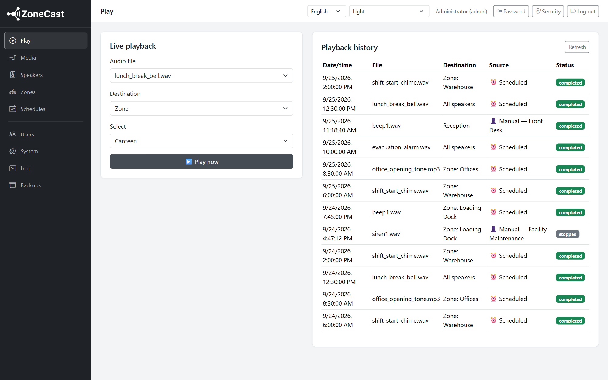 | 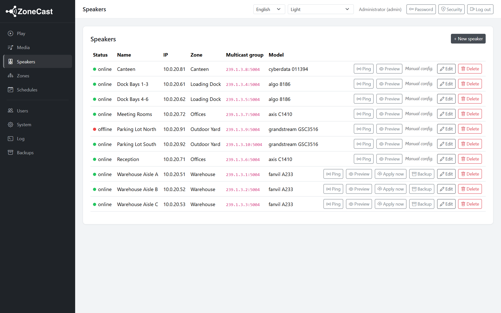 |
| **Zones** | **Schedules** |
| 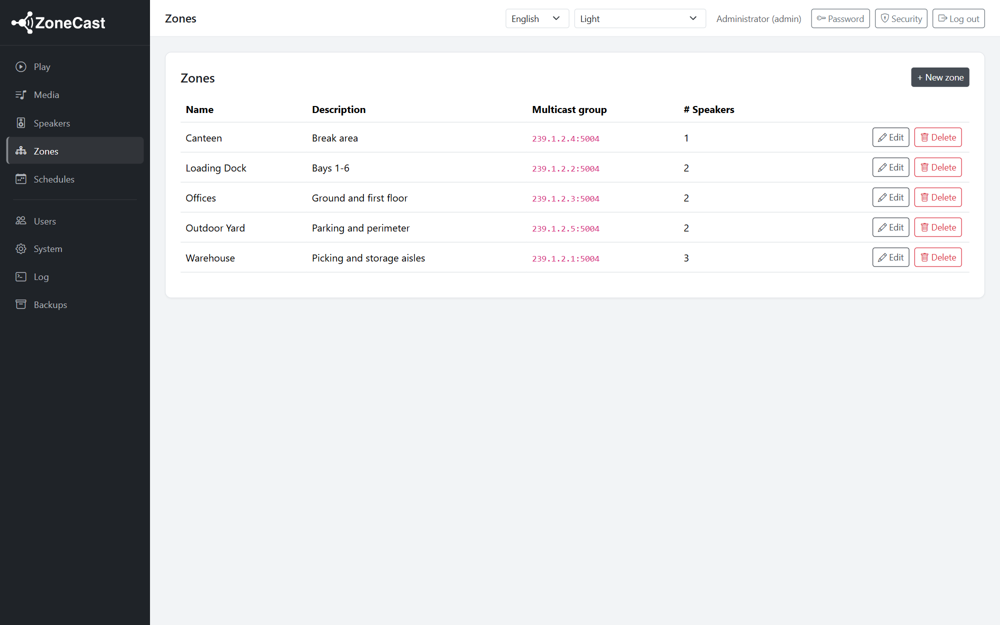 | 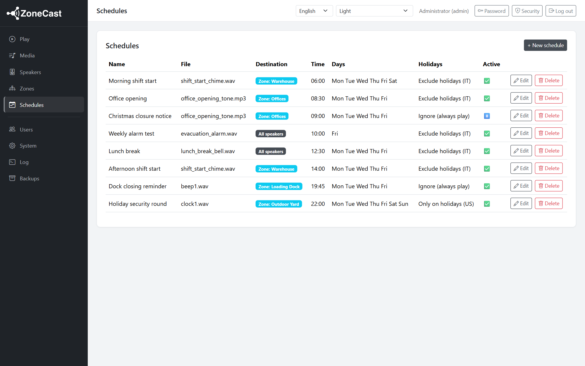 |
| **Media and audio analysis** | **Schedule editor with holiday calendars** |
| 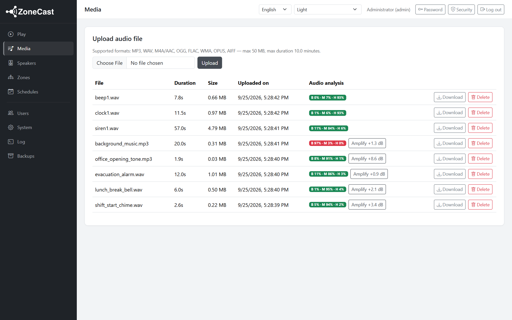 | 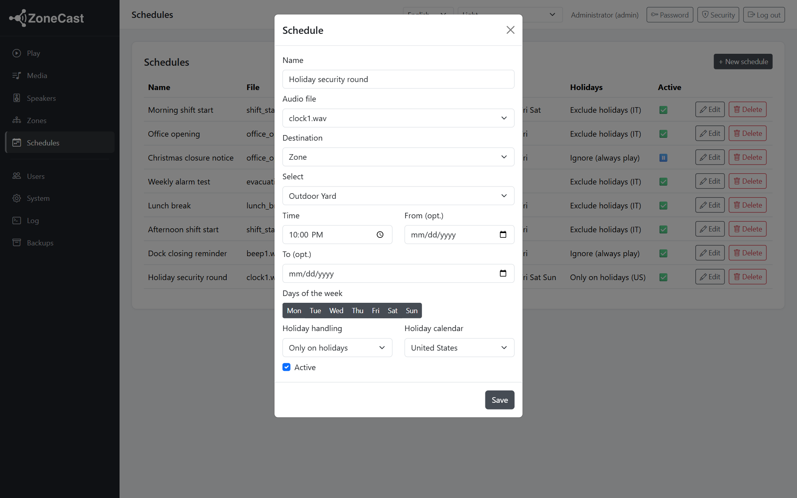 |
| **System panel** | **Dark theme** |
| 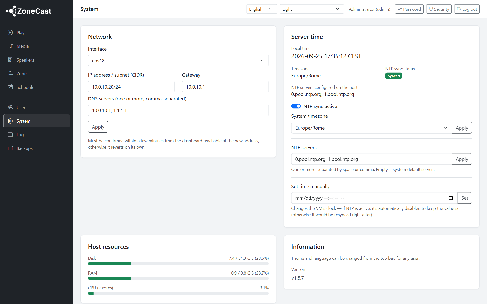 | 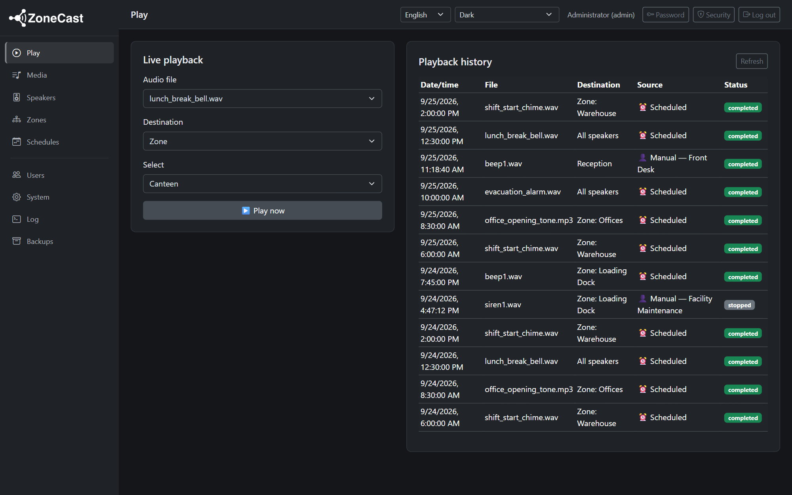 |

### Creating a schedule

<p align="center">
  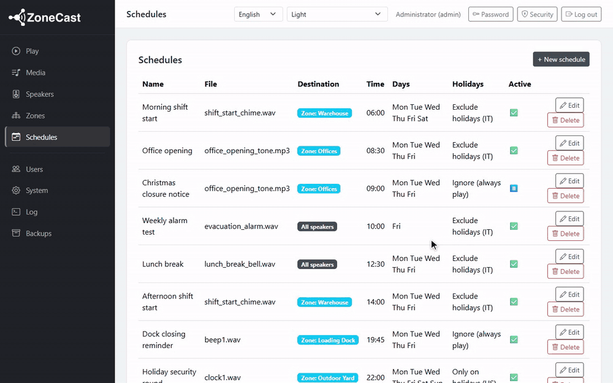
</p>

### On mobile

The whole dashboard works from a phone: the sidebar becomes a drawer
(with language and theme selectors), tables hide secondary columns and
scroll sideways when needed, and action buttons shrink to icons.

<p align="center">
  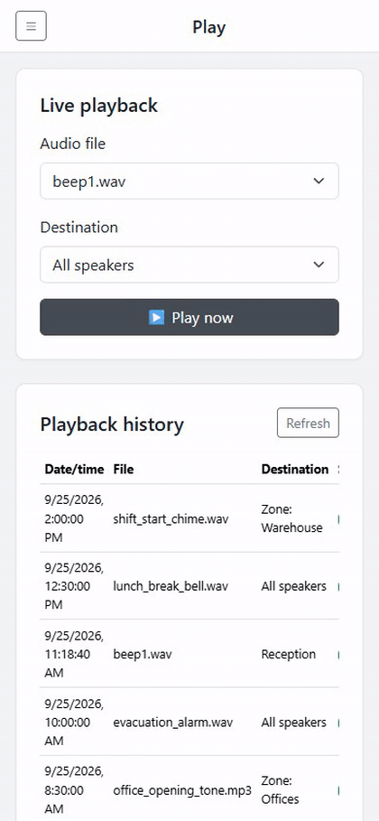
  &nbsp;&nbsp;
  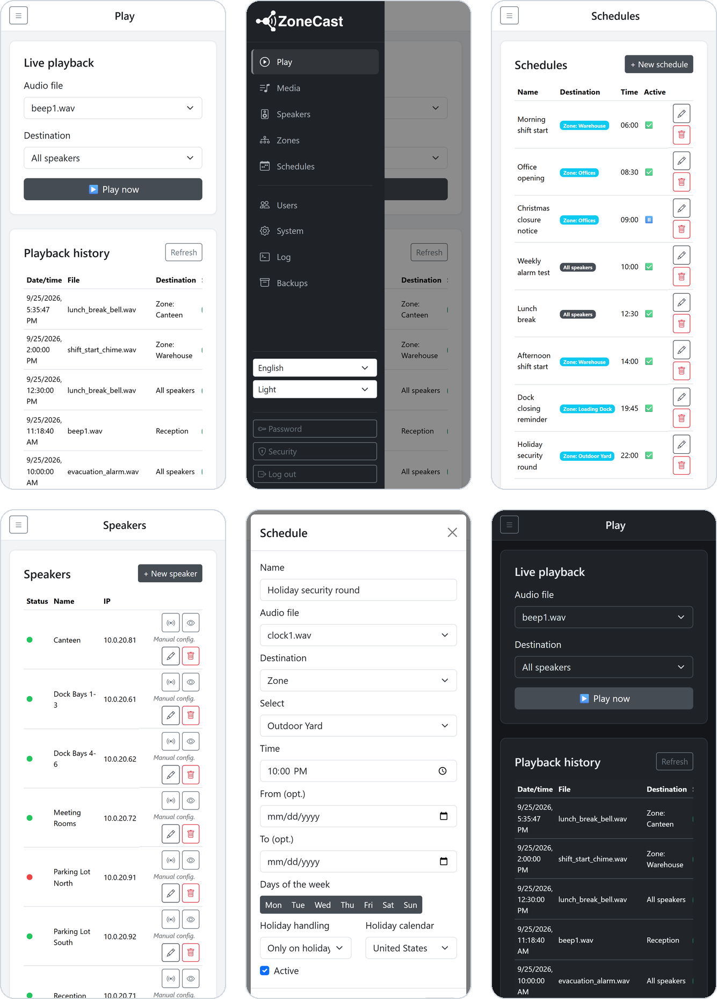
</p>

## 1. Architecture

```
┌─────────────┐      HTTPS/REST      ┌──────────────────────────┐
│  Browser     │ ───────────────────▶ │  FastAPI (backend)       │
│  (vanilla JS │ ◀─────────────────── │  - session auth          │
│  dashboard)  │                      │  - zone/speaker CRUD     │
└─────────────┘                      │  - media upload          │
                                      │  - scheduler (APScheduler)│
                                      └──────────┬────────────────┘
                                                 │ RTP / G.711 (UDP multicast)
                                                 ▼
                                   ┌───────────────────────────────┐
                                   │   LAN — multicast groups        │
                                   │   239.x.x.x per zone/speaker    │
                                   └───────────────────────────────┘
                                      │            │            │
                                  IP speaker    IP speaker    IP speaker
                                  (zone 1)      (zone 1)      (zone 2)
```

**Stack**
- **Backend**: Python 3.11 + FastAPI (async, great for orchestrating network I/O and the scheduler) + SQLAlchemy 2.0 + APScheduler.
- **Frontend**: HTML/Bootstrap 5 + vanilla JavaScript (no build step, a single container to deploy, an SPA-like dashboard using `fetch()`).
- **Database**: SQLite by default (`data/zonecast.db`), portable and sufficient for this data volume; the connection string is configurable, so switching to PostgreSQL is just a `DATABASE_URL` change.
- **Authentication**: server-side sessions (a cookie signed via `SessionMiddleware`), passwords hashed with bcrypt.
- **Holidays**: the [`holidays`](https://pypi.org/project/holidays/) library, with a per-schedule configurable per-country calendar, computed dynamically (handles movable holidays like Easter too) — no static table to maintain.

### Why multicast RTP (and not just HTTP/SIP)

Most IP paging speakers (Fanvil, Algo, CyberData, Grandstream, etc.)
natively implement **Multicast Paging**: from the device's own web UI
you configure a list of *multicast groups* it listens on (receiving
RTP), and it plays **immediately and in perfect sync** as soon as an
audio stream arrives on that address. For our use case (playing to a
single speaker / a zone / everyone, including simultaneously) this is
the most robust approach because:

- **True synchrony**: every speaker in a zone receives the same UDP
  stream at the same instant — no drift like you'd get calling N
  speakers individually over SIP.
- **No per-device state to manage**: no SIP registrations, dialogs, or
  call retries to keep track of — you just send a UDP stream and
  listening devices play it.
- **Scalable**: adding a new speaker is just "add it to the zone's
  multicast group" — the backend doesn't change.

For this reason the backend implements an RTP/G.711 sender **from
scratch** (`app/services/rtp_multicast.py`): it packetizes 8kHz mono
audio into 20ms G.711 frames, builds the RTP header
(seq/timestamp/SSRC), and sends it over UDP with a configurable
`IP_MULTICAST_TTL`, timed in real time.

**Targeting model**: every *Speaker* has its own dedicated multicast
group (for "play to this single speaker"), every *Zone* has its own
group shared by its speakers, and there's a global "all-call" group
every speaker is subscribed to. Playing a file is therefore always the
exact same server-side operation: one RTP stream to one multicast
address — the only thing that differs is which devices are, on their
own web UI, listening on that address.

**HTTP CGI fallback**: `app/services/fanvil_http.py` exposes a
best-effort client for Fanvil's remote-control CGI (protected by
Digest Auth with the same credentials as the device's web admin), used
for extensions like reachability checks, or to invoke specific actions
once the exact CGI syntax has been verified for your firmware with
Fanvil support (it varies across product families and isn't
documented publicly in a consistent way) — the endpoint is
deliberately configurable rather than hard-coded, so as not to promise
an unverified syntax. It isn't needed for actual audio playback: the
multicast path handles that. Automatic CGI-based provisioning is
currently implemented for Fanvil only — other brands are configured
manually on the device (see "Initial setup" below).

**SIP paging as an alternative**: this is an architecturally valid
option (originate a call to the speaker's SIP extension, which
auto-answers) but requires a per-device SIP registration and a real
SIP/RTP stack server-side (e.g. via a PBX like Asterisk). It isn't
implemented here because multicast better covers our actual case
("play simultaneously to multiple speakers"), but the services
architecture (`app/services/`) makes it easy to add a
`sip_paging.py` in the future if you need to reach a speaker that
doesn't support multicast.

## 2. Automatic speaker provisioning and software-managed zones

Zone membership is **entirely managed from the ZoneCast dashboard**
(assigning/changing a speaker's zone, or changing a zone's multicast
address): on brands with automatic provisioning support (see below)
you no longer need to open the device's own web UI to manually
add/remove entries from its multicast paging list on every change.

**How it works**: every speaker must always be listening on three
multicast groups — its own (single-speaker targeting), the one for
its assigned zone (if any), and the global "all-call" one (shared by
everyone). When you change a speaker's zone, or a zone's address, in
the dashboard, the backend (`app/services/multicast_provisioning.py`)
recomputes this list and writes it **in the background, immediately**,
to the device — writing only the individual
`paging.multicast_addr.N` / `paging.multicast_label.N` /
`paging.multicast_priority.N` parameters via CGI
(`app/services/fanvil_http.py`), using the admin credentials already
stored on the speaker's record.

**Why not a full resync/reconfiguration**: a resync would make the
device re-request its entire configuration file, and any setting not
present in that file (SIP account, network, etc.) risks — depending on
the firmware — being overwritten or reset; if the device is already
provisioned by another system (e.g. a PBX) for SIP, redirecting its
auto-provisioning URL to ZoneCast would break that too. By writing
**only** the `paging.*` parameters one at a time, by construction
nothing else is ever touched, and whatever provisioning system is
already handling SIP stays intact.

**Practical use from the dashboard** (Speakers tab):
- **Preview**: shows exactly which `paging.*` entries would be written
  to the device, without sending anything — useful to verify before
  applying.
- **Apply now**: forces an immediate (re)write, useful after a device
  reset or if a field change was reverted manually.
- The automatic background push only fires when fields affecting the
  paging list change (assigned zone, or the speaker's/zone's own
  multicast address/port) — changes to name, location, credentials,
  etc. don't trigger unnecessary device writes.

**Initial per-speaker setup** (one-time, from the device's own web
UI):
1. Enable multicast paging and set the codec to match
   `RTP_PAYLOAD_TYPE` (default `0` = G.711 µ-law/PCMU; `8` for
   A-law/PCMA).
2. Enter the device's web UI admin credentials
   (`http_username`/`http_password`) into the speaker's record in
   ZoneCast — these are the ones used for the CGI write channel (on
   brands with automatic provisioning support).
3. Do a first **Apply now** from the dashboard and check on the
   device's own web UI that the three entries appear correctly.

> ⚠️ **Verify before using in production**: the exact write-parameter
> CGI syntax (`ConfigManApp.com?key=...&value=...` in
> `fanvil_http.py`) isn't documented publicly in a consistent way and
> varies across firmware families — it's a plausible starting point,
> not a certainty. Before applying it to your whole fleet: export/save
> the configuration of ONE non-critical device from its web UI, test
> "Apply now" on it, and compare the exported configuration
> before/after to make sure only the paging entries changed. If the
> syntax doesn't match your firmware, the push fails harmlessly (a 502
> in the dashboard, no write happens) and you can always configure it
> manually as a fallback (see the addresses shown in "Preview").

> Network note: multicast addresses (`239.0.0.0/8`, the
> "administratively scoped" range) need to be reachable between the
> server and the switches/VLANs where the speakers live — check that
> IGMP snooping/querier is enabled on the network switches if speakers
> sit on different segments from the server.

## 3. Database structure

| Table              | Purpose |
|---------------------|---------|
| `users`             | Dashboard login accounts (`admin`/`operator` roles) |
| `zones`             | Logical groupings of speakers, each with its own multicast group |
| `speakers`          | Speaker records: IP, web credentials, zone, dedicated multicast group, status |
| `media`             | Uploaded audio files (original + pre-converted PCM 8kHz version for streaming) |
| `schedules`         | Scheduling rules: media, target, time, days, date range, holiday rule, holiday calendar country |
| `playback_logs`     | History of playbacks (manual and scheduled), with status and any errors |

See `app/models.py` for field-level details.

### Schema migrations (Alembic)

Schema changes are managed with Alembic instead of by hand:

```bash
alembic revision --autogenerate -m "describe the change"
alembic upgrade head
```

`render_as_batch` is enabled in the included `env.py`, so even changes
SQLite doesn't support directly (e.g. changing a column's type or
nullability) are handled automatically via the "recreate the table and
copy the data" technique — no more manual scripts for these
operations. On an existing installation not yet tracked by Alembic,
align it once, without running anything, with `alembic stamp head`.

## 4. Running locally (without Docker)

Requires Python 3.11+ (also tested on 3.13/3.14 — the `audioop-lts`
backport in `requirements.txt` covers `audioop`'s removal from the
stdlib starting with Python 3.13) and **ffmpeg** on the PATH (used to
convert uploads to PCM 8kHz mono for G.711 streaming).

```bash
python -m venv .venv
.venv\Scripts\activate            # Windows
# source .venv/bin/activate       # Linux/Mac

pip install -r requirements.txt
copy .env.example .env            # Windows: copy — Linux/Mac: cp
uvicorn app.main:app --reload --host 0.0.0.0 --port 8000
```

Open `http://localhost:8000` — initial user: whatever is set in
`.env` (`DEFAULT_ADMIN_USERNAME` / `DEFAULT_ADMIN_PASSWORD`, default
`admin`/`admin`). **Change the password immediately**, either by
creating a new admin user and disabling/deleting the default one, or
with:

```bash
python scripts/reset_admin_password.py admin "YourNewSecurePassword!"
```

## 5. Docker deployment

### Linux (recommended for production)

```bash
cp .env.example .env   # customize SECRET_KEY, credentials, etc.
docker compose up -d --build
```

`docker-compose.yml` uses `network_mode: host`, which is essential so
multicast RTP traffic actually reaches the physical LAN where the
speakers live (Docker's default bridge does NAT and doesn't route
multicast to the outside network).

### Windows

Docker Desktop on Windows **doesn't support** `network_mode: host`.
Two options:

- **Recommended option for production use on a LAN**: run the
  application natively on Windows (section 4, no Docker) — it's a
  single Python process, no need to containerize it if the server is
  dedicated.
- **Docker on Windows option**: use Docker Desktop's WSL2 engine with
  a `macvlan` network attached to the physical adapter, so the
  container gets a real IP on the LAN (required for multicast).
  Example:
  ```bash
  docker network create -d macvlan \
    --subnet=192.168.187.0/24 --gateway=192.168.187.1 \
    -o parent=eth0 zonecast-lan
  ```
  then attach the `zonecast` service to `zonecast-lan` instead of
  `network_mode: host` in the compose file (see the comments in the
  file).

The bridge/`ports: 8000:8000` variant included (commented out) in
`docker-compose.yml` is only useful for developing the dashboard —
audio won't reach the speakers until the container has a real
multicast egress path.

### Native deployment (no Docker) — dedicated Ubuntu Server LTS

For a VM/machine dedicated solely to ZoneCast, a native install
completely avoids Docker's bridge multicast/NAT issues (the app talks
directly to the host's interfaces) and the AppArmor/D-Bus limitations
around NTP — at the cost of managing Python/systemd by hand instead of
an image. On Ubuntu Server 24.04+/26.04 LTS:

```bash
git clone https://github.com/ZampyZampy/ZoneCast.git /tmp/zonecast-src && cd /tmp/zonecast-src
sudo ./deploy/install_ubuntu.sh
```

Installs the app in `/opt/zonecast`, creates a dedicated unprivileged
system user (`zonecast`), a virtualenv, and a systemd service
(`deploy/zonecast.service`, with `CAP_SYS_TIME` granted natively for
manually setting the clock). See the comments in
`deploy/install_ubuntu.sh` for details. Managing the service:

```bash
sudo systemctl status zonecast
sudo journalctl -u zonecast -f
sudo systemctl restart zonecast
```

To transfer all the data from an existing installation (speakers,
zones, schedules, users, media, backups) onto this new machine, use
the full export from System > "Export full configuration" on the
source installation, then, on the new machine, **before** the
service's first start:

```bash
sudo systemctl stop zonecast   # if already started by the installer
cd /opt/zonecast
sudo -u zonecast venv/bin/python -m app.tools.import_bundle /path/to/export.zcbundle
sudo systemctl start zonecast
```

## 6. Operational notes

- Audio files are converted on upload into a 16-bit PCM 8kHz mono copy
  (`media/<id>.pcm8k.wav`), the format required for G.711/RTP encoding
  — the original is still kept too.
- The scheduler (APScheduler, `Europe/Rome` timezone by default)
  reloads jobs on startup and updates them on every change via the
  API; each job, when it fires, also checks the holiday rule and any
  date range, so nothing needs recomputing when you edit a schedule.
- Adding a new speaker brand in the future only requires: provisioning
  the multicast group on the device (if it supports standard
  multicast paging) + registering it in the dashboard — no backend
  changes needed.
- The installed app's version and changelog are available from System
  > Information (updated on every release — see `app/version.py`).
- The `sounds/` folder contains a few sample audio files (siren,
  clock, beep) ready to use for testing/demos.
  `deploy/install_ubuntu.sh` copies them automatically and preloads
  them into Media on first deploy via `app/tools/seed_sample_media.py`
  (idempotent: re-running it never creates duplicates). To load them
  manually onto an existing installation:
  ```bash
  sudo -u zonecast /opt/zonecast/venv/bin/python -m app.tools.seed_sample_media
  ```

## 7. Documentation

- Technical deployment guide for a blank machine — requirements,
  architecture, installation (native/Docker), migration, security,
  day-to-day operations, common troubleshooting:
  [English](docs/ZoneCast_Deploy_Guide_en.pdf) /
  [Italiano](docs/ZoneCast_Guida_Deploy_it.pdf).
- Illustrated end-user manual, with a screenshot of every dashboard
  section: [English](docs/ZoneCast_User_Manual_en.pdf) /
  [Italiano](docs/ZoneCast_Manuale_Utente_it.pdf).
- [`docs/zonecast_install_kit.tar.gz`](docs/zonecast_install_kit.tar.gz)
  — ready-to-use package for a native install on a machine without
  direct access to this repository (contains `app/`, `deploy/`,
  `requirements.txt`, `Dockerfile`, `docker-compose.yml`,
  `.env.example`, `README.md`).

## License

[MIT](LICENSE)
