<p align="center">
  
  
</p>

# ZoneCast — PA / intercom system over IP

[](https://github.com/ZampyZampy/ZoneCast/actions/workflows/tests.yml)
[](LICENSE)

Web application for managing a PA/intercom sound system built on IP
speakers, designed to stay brand-agnostic — a dropdown with the most
common multicast-paging brands (Fanvil, Algo, CyberData, Grandstream,
Axis, Tiptel, Akuvox) plus a free-text "Other" option. Lets you
register speakers, group them into zones (a speaker can be in several),
upload audio files, play them on demand, and schedule them over time
with per-country holidays and your own custom dates — without two
schedules ever playing on the same speaker at once.

<p align="center">
  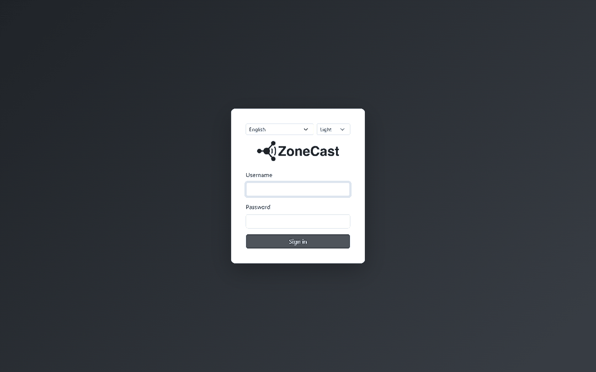
</p>
<p align="center"><sub>Sign in → play a file to a zone → speakers → a zone's members → schedules and custom dates → media → automatic backup → dark theme → Italian / Japanese</sub></p>

## Key features

- **Multicast RTP playback** to zones, single speakers, or the whole
  fleet, with a playback history. Starting an announcement on speakers
  that are already playing asks first: stop what's playing, play
  alongside, or cancel.
- **Zones managed from the dashboard**: a speaker can belong to
  several zones, members are picked from a searchable list in the
  Zones tab, and supported devices are reconfigured automatically
  (with an "out of sync" badge if a device didn't take the change).
- **Recurring schedules** with a per-country holiday calendar (Italy,
  United States, United Kingdom, France, Germany, Spain, Japan, China)
  — exclude holidays, always include them, or play only on holidays —
  and **custom dates** (closures, exam days, yearly dates) a schedule
  can skip or be limited to.
- **No overlapping schedules**: saving a schedule that would play on
  the same speaker at the same time as another one is refused, naming
  the schedule in the way; a bell due during a live announcement waits
  for it to end instead of cutting in.
- **Automatic audio analysis** of uploaded files, with a warning when
  bass is dominant (not ideal for PA horns) and a suggested gain
  amplification when there's headroom before clipping.
- **Automatic provisioning** for supported devices (see section 2) and
  backup/restore of their configuration.
- **Two user roles**: admin (full access, including the
  Users/System/Logs/Backup archive sections, plus direct device
  actions like "Apply now" and "Backup") and operator (playback,
  managing speakers/zones/media/schedules).
- **Optional per-user 2FA** (TOTP + recovery codes), **full
  export/import** of the installation (database, media, device
  backups, encryption key) for migrating between machines, and
  **automatic backups** on a daily or weekly schedule, kept on the
  server and optionally copied to an FTPS/FTP server or an SMB share.
- **System panel** (admin only): network (IP/DNS/gateway with a trial
  period), time/NTP, host resource monitoring (disk/RAM/CPU),
  changelog and version number.
- **Multilingual interface** (English, Italian, Chinese, Japanese,
  German, Spanish, French) with light/dark/automatic theme (based on
  real sunrise/sunset), chosen independently by each user. The
  dashboard loads nothing from the internet (it works on an isolated
  LAN) and runs under a strict Content Security Policy.

## Screenshots

| Live playback and history | Speakers already playing? It asks first |
|:---:|:---:|
| 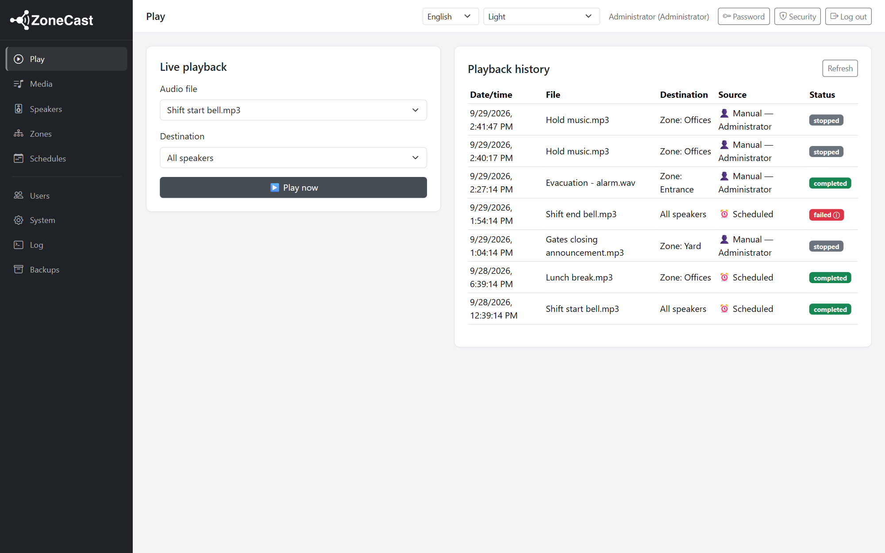 | 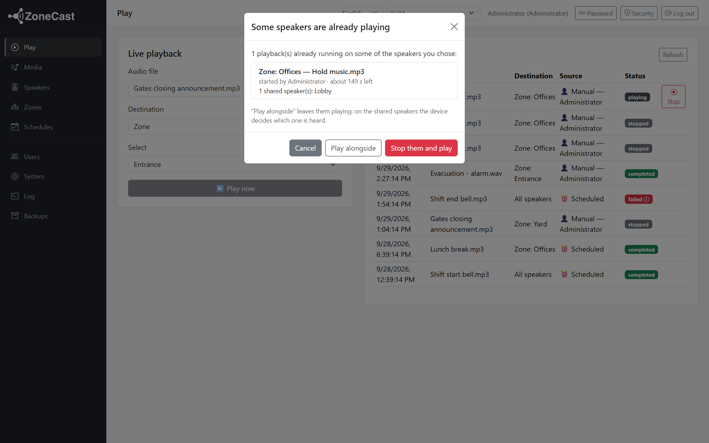 |
| **Speakers** | **Zones** |
| 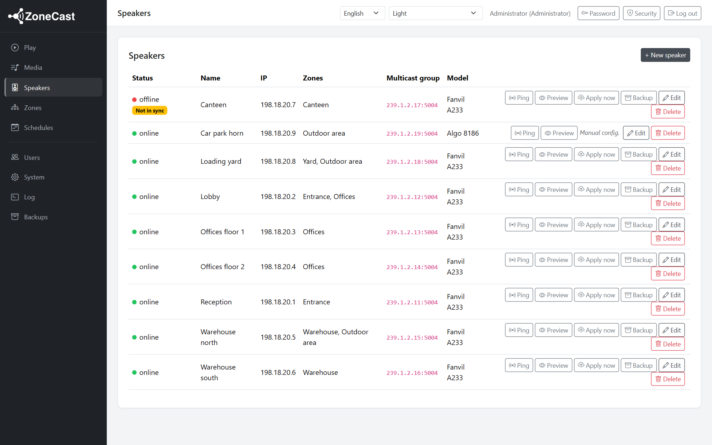 | 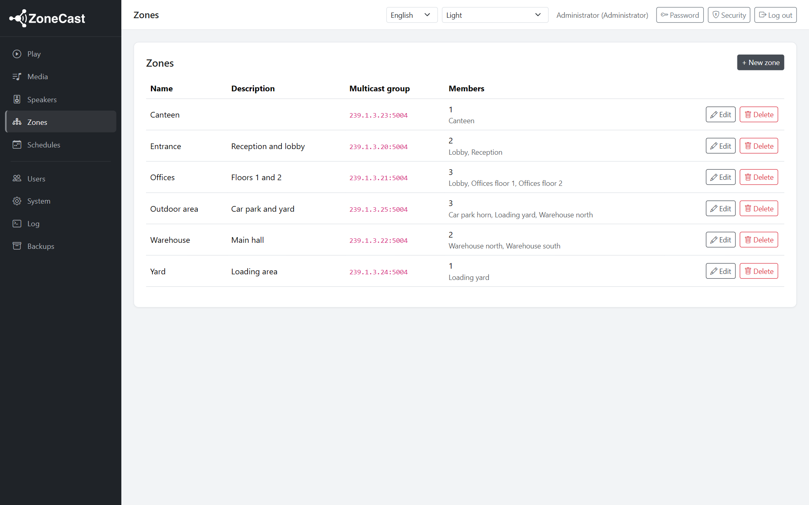 |
| **A zone's members** | **Schedules and custom dates** |
| 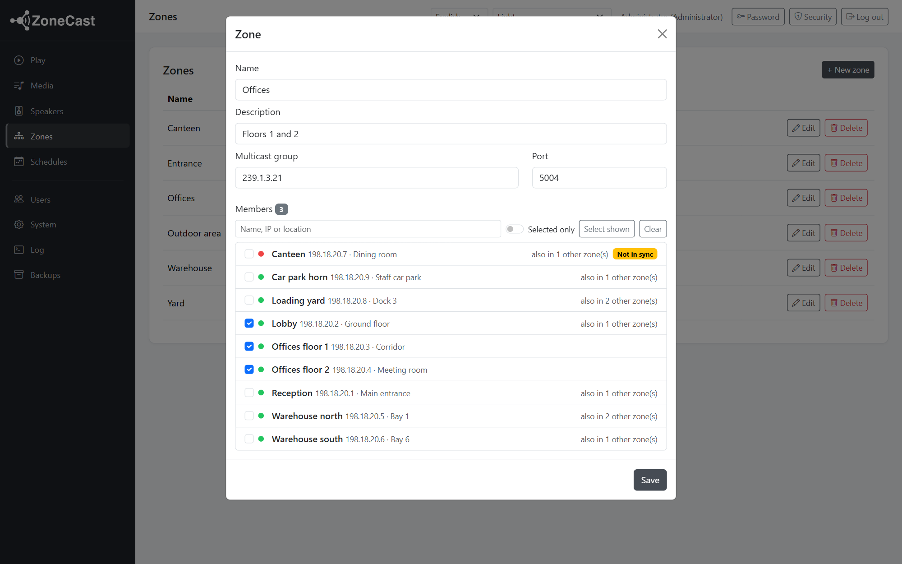 | 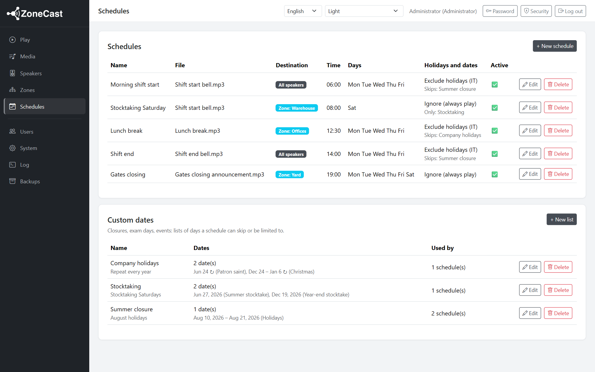 |
| **Schedule editor** | **Media and audio analysis** |
| 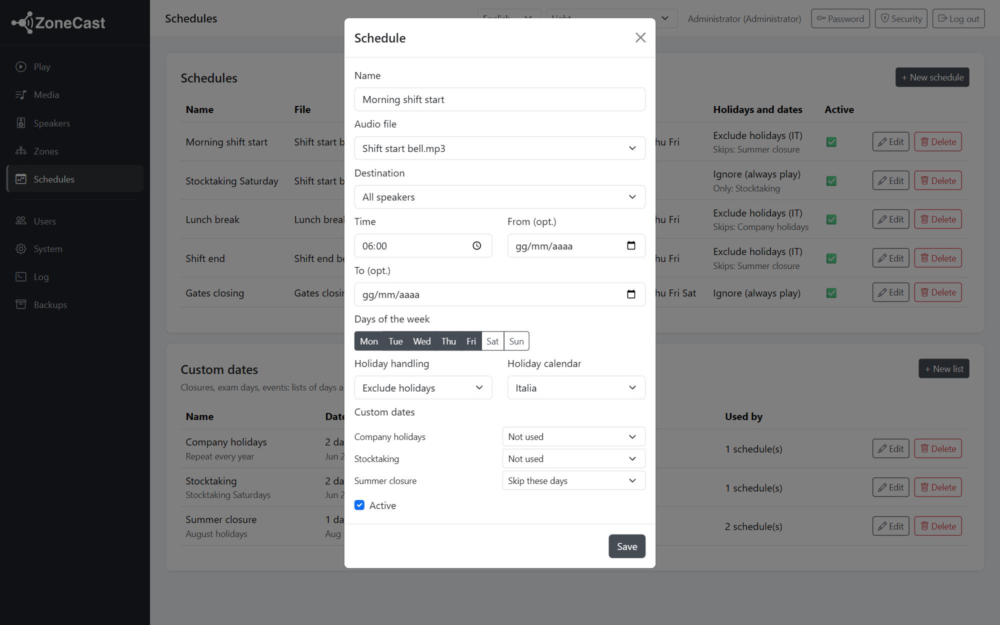 | 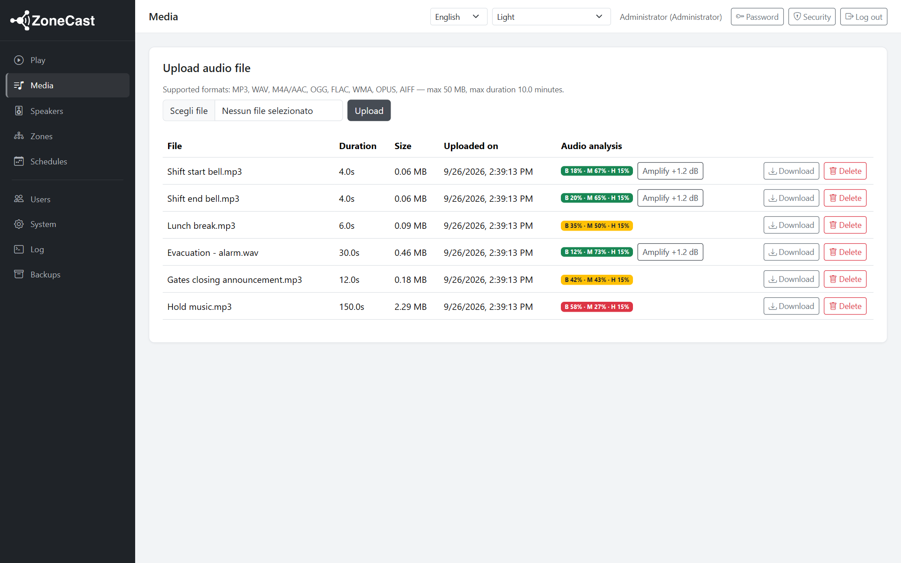 |
| **Automatic backup** | **Dark theme** |
| 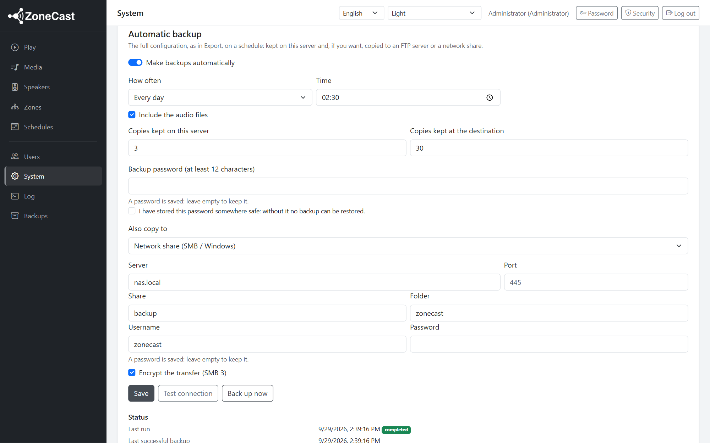 | 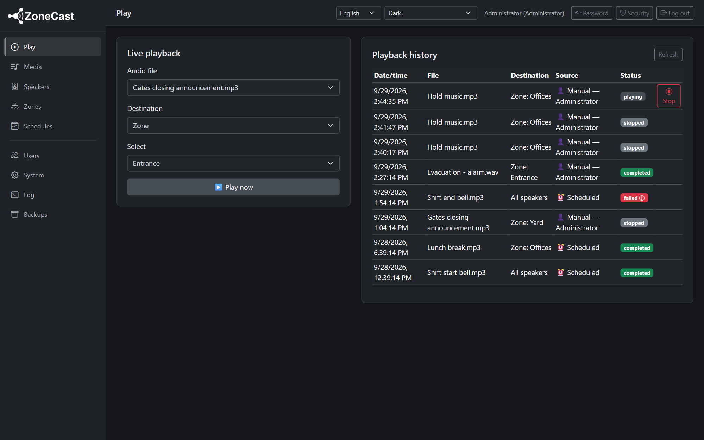 |

### Creating a schedule

<p align="center">
  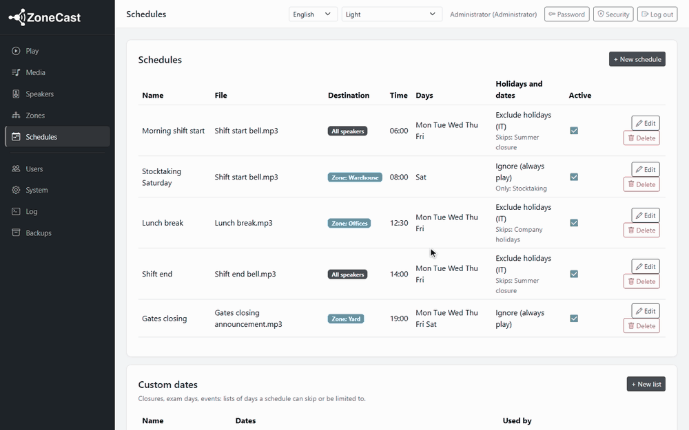
</p>

### On mobile

The whole dashboard works from a phone: the sidebar becomes a drawer
(with language and theme selectors), tables hide secondary columns and
scroll sideways when needed, and action buttons shrink to icons.

<p align="center">
  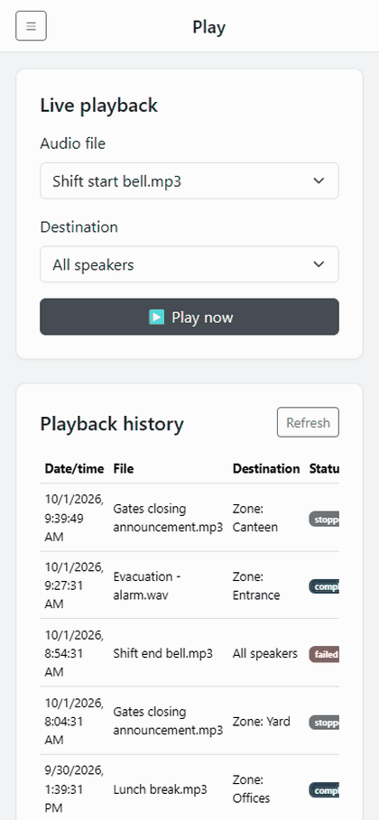
  &nbsp;&nbsp;
  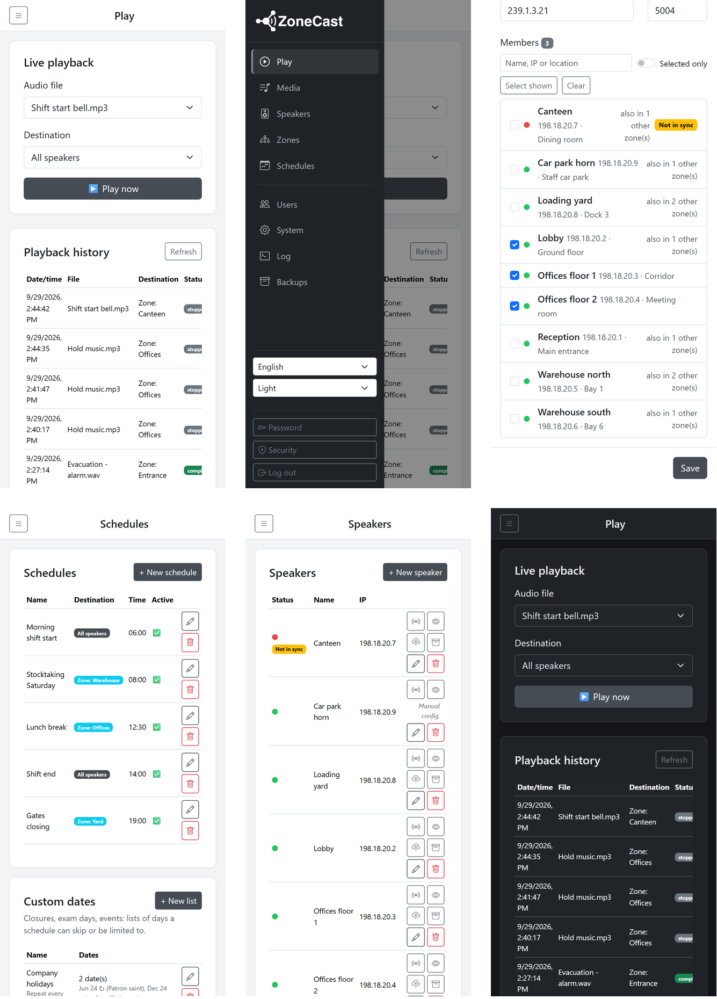
</p>

## 1. Architecture

```
┌─────────────┐      HTTPS/REST      ┌──────────────────────────┐
│  Browser     │ ───────────────────▶ │  FastAPI (backend)       │
│  (vanilla JS │ ◀─────────────────── │  - session auth          │
│  dashboard)  │                      │  - zone/speaker CRUD     │
└─────────────┘                      │  - media upload          │
                                      │  - scheduler (APScheduler)│
                                      └──────────┬────────────────┘
                                                 │ RTP / G.711 (UDP multicast)
                                                 ▼
                                   ┌───────────────────────────────┐
                                   │   LAN — multicast groups        │
                                   │   239.x.x.x per zone/speaker    │
                                   └───────────────────────────────┘
                                      │            │            │
                                  IP speaker    IP speaker    IP speaker
                                  (zone 1)      (zone 1)      (zone 2)
```

**Stack**
- **Backend**: Python 3.11 + FastAPI (async, great for orchestrating network I/O and the scheduler) + SQLAlchemy 2.0 + APScheduler.
- **Frontend**: HTML/Bootstrap 5 + vanilla JavaScript (no build step, a single container to deploy, an SPA-like dashboard using `fetch()`).
- **Database**: SQLite by default (`data/zonecast.db`), portable and sufficient for this data volume; the connection string is configurable, so switching to PostgreSQL is just a `DATABASE_URL` change.
- **Authentication**: server-side sessions (a cookie signed via `SessionMiddleware`), passwords hashed with bcrypt.
- **Holidays**: the [`holidays`](https://pypi.org/project/holidays/) library, with a per-schedule configurable per-country calendar, computed dynamically (handles movable holidays like Easter too) — no static table to maintain.

### Why multicast RTP (and not just HTTP/SIP)

Most IP paging speakers (Fanvil, Algo, CyberData, Grandstream, etc.)
natively implement **Multicast Paging**: from the device's own web UI
you configure a list of *multicast groups* it listens on (receiving
RTP), and it plays **immediately and in perfect sync** as soon as an
audio stream arrives on that address. For our use case (playing to a
single speaker / a zone / everyone, including simultaneously) this is
the most robust approach because:

- **True synchrony**: every speaker in a zone receives the same UDP
  stream at the same instant — no drift like you'd get calling N
  speakers individually over SIP.
- **No per-device state to manage**: no SIP registrations, dialogs, or
  call retries to keep track of — you just send a UDP stream and
  listening devices play it.
- **Scalable**: adding a new speaker is just "add it to the zone's
  multicast group" — the backend doesn't change.

For this reason the backend implements an RTP/G.711 sender **from
scratch** (`app/services/rtp_multicast.py`): it packetizes 8kHz mono
audio into 20ms G.711 frames, builds the RTP header
(seq/timestamp/SSRC), and sends it over UDP with a configurable
`IP_MULTICAST_TTL`, timed in real time.

**Targeting model**: every *Speaker* has its own dedicated multicast
group (for "play to this single speaker"), every *Zone* has its own
group shared by its member speakers (a speaker in several zones
listens to each of their groups), and there's a global "all-call"
group every speaker is subscribed to. Playing a file is therefore always the
exact same server-side operation: one RTP stream to one multicast
address — the only thing that differs is which devices are, on their
own web UI, listening on that address.

**Device drivers**: automatic configuration is done by per-brand
drivers (`app/services/drivers/`). The Fanvil driver
(`fanvil_http.py`) writes the multicast paging list through the same
web form the device's own UI uses (session login, `mcast.htm`) and
reads it back to verify — confirmed on a Fanvil A233. Other brands are
configured manually on the device (see "Initial setup" below); adding
a driver for another brand doesn't touch the rest of the app. The
driver isn't involved in playback itself: the multicast path handles
that.

**SIP paging as an alternative**: this is an architecturally valid
option (originate a call to the speaker's SIP extension, which
auto-answers) but requires a per-device SIP registration and a real
SIP/RTP stack server-side (e.g. via a PBX like Asterisk). It isn't
implemented here because multicast better covers our actual case
("play simultaneously to multiple speakers"), but the services
architecture (`app/services/`) makes it easy to add a
`sip_paging.py` in the future if you need to reach a speaker that
doesn't support multicast.

## 2. Automatic speaker provisioning and software-managed zones

Zone membership is **entirely managed from the ZoneCast dashboard**:
open a zone in the Zones tab and tick its member speakers (a searchable
list; a speaker can be in several zones). On brands with automatic
provisioning support (see below) you never need to open the device's
own web UI to edit its multicast paging list.

**How it works**: every speaker listens on its own group
(single-speaker targeting), one group per zone it belongs to, and the
global "all-call" group — in that slot order, zones in a stable order
that doesn't change when a zone is renamed. When a zone's members,
address or name change, or a speaker's own group, the backend
(`app/services/multicast_provisioning.py`) recomputes the list and
writes it **in the background** to the affected devices only, one
request at a time per device (a Fanvil doesn't cope with concurrent
requests) and always ending with the latest list. A Fanvil has 20
paging slots, so a speaker can be in up to 18 zones. If a device
doesn't accept its new list (offline, wrong credentials), the Speakers
tab marks it **Not in sync**, a login alert says so, and the list is
pushed again as soon as the device answers.

**Why not a full resync/reconfiguration**: a resync would make the
device re-request its entire configuration file, and any setting not
present in that file (SIP account, network, etc.) risks — depending on
the firmware — being overwritten or reset; if the device is already
provisioned by another system (e.g. a PBX) for SIP, redirecting its
auto-provisioning URL to ZoneCast would break that too. By writing
**only** the `paging.*` parameters one at a time, by construction
nothing else is ever touched, and whatever provisioning system is
already handling SIP stays intact.

**Practical use from the dashboard** (Speakers tab):
- **Preview**: shows exactly which `paging.*` entries would be written
  to the device, without sending anything — useful to verify before
  applying.
- **Apply now**: forces an immediate (re)write, useful after a device
  reset or if a field change was reverted manually.
- The automatic background push only fires when something the device
  stores changes (zone members, a zone's or speaker's multicast
  address/port or name, the paging volume, or how to reach the device)
  — other edits don't trigger unnecessary device writes.

**Initial per-speaker setup** (one-time, from the device's own web
UI):
1. Enable multicast paging and set the codec to match
   `RTP_PAYLOAD_TYPE` (default `0` = G.711 µ-law/PCMU; `8` for
   A-law/PCMA).
2. Enter the device's web UI admin credentials
   (`http_username`/`http_password`) into the speaker's record in
   ZoneCast — these are the ones used for the CGI write channel (on
   brands with automatic provisioning support).
3. Do a first **Apply now** from the dashboard and check on the
   device's own web UI that the entries appear correctly.

> ⚠️ **Verify on your firmware first**: the Fanvil write path was
> verified on an A233 (firmware 2.12.58.24). Before applying it to a
> whole fleet of another model or firmware: back up the configuration
> of ONE non-critical device (the **Backup** button), test "Apply now"
> on it, and compare the configuration before/after to make sure only
> the paging entries changed. A push that doesn't take is reported
> (and the device marked "Not in sync"), and you can always configure
> the device by hand from the addresses shown in "Preview".

> Network note: multicast addresses (`239.0.0.0/8`, the
> "administratively scoped" range) need to be reachable between the
> server and the switches/VLANs where the speakers live — check that
> IGMP snooping/querier is enabled on the network switches if speakers
> sit on different segments from the server.

## 3. Database structure

| Table              | Purpose |
|---------------------|---------|
| `users`             | Dashboard login accounts (`admin`/`operator` roles) |
| `zones`             | Logical groupings of speakers, each with its own multicast group |
| `speakers`          | Speaker records: IP, web credentials, dedicated multicast group, status, outcome of the last device push |
| `zone_members`      | Which speakers belong to which zones (a speaker can be in several) |
| `media`             | Uploaded audio files (original + pre-converted PCM 8kHz version for streaming) |
| `schedules`         | Scheduling rules: media, target, time, days, date range, holiday rule, holiday calendar country |
| `custom_calendars`, `custom_calendar_dates` | Named lists of dates/ranges (optionally yearly) |
| `schedule_calendars` | Which custom-dates lists a schedule skips or is limited to |
| `playback_logs`     | History of playbacks (manual and scheduled), with status and any errors |
| `backup_policy`     | Automatic backup settings (credentials encrypted) and the outcome of the last run |
| `app_settings`, `event_logs`, `speaker_config_backups` | Theme/timezone/log retention, the event log, device configuration backups |

See `app/models.py` for field-level details.

### Schema migrations (Alembic)

The schema is brought up to date **automatically at every start**
(`app/migrate.py`), in a single transaction, before anything else opens
the database — on the native install, on Docker and after importing a
bundle from an older version. Installations from before Alembic are
recognised and upgraded too. Before any upgrade the database is copied
next to itself (`zonecast.db.pre-upgrade-<revision>-<time>`, the
newest three are kept), so a release can be rolled back. A bundle
exported by a newer version is refused at import instead of breaking
the next start: upgrade every installation before moving bundles
between them.

For development (see [CONTRIBUTING.md](CONTRIBUTING.md)):

```bash
alembic revision --autogenerate -m "describe the change"
alembic check
```

## 4. Running locally (without Docker)

Requires Python 3.11+ (tested on 3.11 to 3.14 — the `audioop-lts`
backport in `requirements.txt` covers `audioop`'s removal from the
stdlib starting with Python 3.13) and **ffmpeg** on the PATH (used to
convert uploads to PCM 8kHz mono for G.711 streaming).
`requirements.txt` pins every package with its hash; for tests and
tools use `requirements-dev.txt` (see [CONTRIBUTING.md](CONTRIBUTING.md)).

```bash
python -m venv .venv
.venv\Scripts\activate            # Windows
# source .venv/bin/activate       # Linux/Mac

pip install -r requirements.txt
copy .env.example .env            # Windows: copy — Linux/Mac: cp
uvicorn app.main:app --reload --host 0.0.0.0 --port 8000
```

Open `http://localhost:8000` — initial user: whatever is set in
`.env` (`DEFAULT_ADMIN_USERNAME` / `DEFAULT_ADMIN_PASSWORD`, default
`admin`/`admin`). **Change the password immediately**, either by
creating a new admin user and disabling/deleting the default one, or
with:

```bash
python scripts/reset_admin_password.py admin "YourNewSecurePassword!"
```

## 5. Docker deployment

### Linux (recommended for production)

```bash
cp .env.example .env   # customize SECRET_KEY, credentials, etc.
mkdir -p data media backups && sudo chown -R 1000:1000 data media backups
docker compose up -d --build
```

The app runs as an unprivileged user (uid 1000) inside the container,
so the `data`, `media` and `backups` folders must belong to it: if Docker
creates them itself they belong to root, and ZoneCast stops at startup
with a message giving the same `chown` command.

`docker-compose.yml` uses `network_mode: host`, which is essential so
multicast RTP traffic actually reaches the physical LAN where the
speakers live (Docker's default bridge does NAT and doesn't route
multicast to the outside network).

In Docker the System tab shows the clock and whether the host keeps it
in sync (read from the kernel, so it works with chrony and
systemd-timesyncd alike); NTP servers, NTP on/off and the timezone are
managed on the host itself.

### Windows

Docker Desktop on Windows **doesn't support** `network_mode: host`.
Two options:

- **Recommended option for production use on a LAN**: run the
  application natively on Windows (section 4, no Docker) — it's a
  single Python process, no need to containerize it if the server is
  dedicated.
- **Docker on Windows option**: use Docker Desktop's WSL2 engine with
  a `macvlan` network attached to the physical adapter, so the
  container gets a real IP on the LAN (required for multicast).
  Example:
  ```bash
  docker network create -d macvlan \
    --subnet=192.168.187.0/24 --gateway=192.168.187.1 \
    -o parent=eth0 zonecast-lan
  ```
  then attach the `zonecast` service to `zonecast-lan` instead of
  `network_mode: host` in the compose file (see the comments in the
  file).

The bridge/`ports: 8000:8000` variant included (commented out) in
`docker-compose.yml` is only useful for developing the dashboard —
audio won't reach the speakers until the container has a real
multicast egress path.

### Native deployment (no Docker) — dedicated Ubuntu Server LTS

For a VM/machine dedicated solely to ZoneCast, a native install
completely avoids Docker's bridge multicast/NAT issues (the app talks
directly to the host's interfaces) and the AppArmor/D-Bus limitations
around NTP — at the cost of managing Python/systemd by hand instead of
an image. On Ubuntu Server 24.04+/26.04 LTS:

```bash
git clone https://github.com/ZampyZampy/ZoneCast.git /tmp/zonecast-src && cd /tmp/zonecast-src
sudo ./deploy/install_ubuntu.sh
```

Installs the app in `/opt/zonecast`, creates a dedicated unprivileged
system user (`zonecast`), a virtualenv, and a systemd service
(`deploy/zonecast.service`, with `CAP_SYS_TIME` granted natively for
manually setting the clock). See the comments in
`deploy/install_ubuntu.sh` for details. Managing the service:

```bash
sudo systemctl status zonecast
sudo journalctl -u zonecast -f
sudo systemctl restart zonecast
```

To transfer all the data from an existing installation (speakers,
zones, schedules, users, media, backups) onto this new machine, use
the full export from System > "Export full configuration" on the
source installation, then, on the new machine, **before** the
service's first start:

```bash
sudo systemctl stop zonecast   # if already started by the installer
sudo -u zonecast sh -c 'cd /opt/zonecast && venv/bin/python -m app.tools.import_bundle /path/to/export.zcbundle'
sudo systemctl start zonecast
```

## 6. Operational notes

- Audio files are converted on upload into a 16-bit PCM 8kHz mono copy
  (`media/<id>.pcm8k.wav`), the format required for G.711/RTP encoding
  — the original is still kept too.
- The scheduler (APScheduler, `Europe/Rome` timezone by default, or
  the one chosen in System) reloads jobs on startup and updates them
  on every change via the API; each job, when it fires, also checks the
  date range, the holiday rule and the custom dates, so nothing needs
  recomputing when you edit a schedule.
- **Overlaps**: a schedule runs from its start time to the end of its
  audio file. Saving one that would overlap another enabled schedule
  on any shared speaker (directly, through a zone, or via "all") is
  refused; the check looks two years ahead, day by day, with the same
  rules the scheduler uses. Overlaps that already existed don't block
  unrelated edits (a rename), and overlaps created later by zone
  members or custom dates are reported and flagged in the list.
- **Live announcements vs schedules**: a live announcement always
  wins. A bell due while it plays on some of the same speakers waits
  for it to end (up to 60 s) and then plays; if it has to wait longer
  it's recorded as failed in the history (and in the login alert).
- **Automatic backups** (System tab, admin only) are the same
  encrypted bundle as the manual export, built in a low-priority child
  process, never while audio plays or a bell is about to ring. They are
  kept in `data/auto_backups/` and can also be copied to an FTPS server
  (the certificate must be trusted, or its fingerprint pinned), plain
  FTP (only after explicit consent) or an SMB2/3 share (encrypted by
  default). Retention only ever deletes this installation's own files.
  Restore one with System > Import configuration, using the backup
  password — keep it safe: without it no backup can be opened. A
  failed or overdue backup raises a login alert.
- Adding a new speaker brand in the future only requires: provisioning
  the multicast group on the device (if it supports standard
  multicast paging) + registering it in the dashboard — no backend
  changes needed.
- The installed app's version and changelog are available from System
  > Information (updated on every release — see `app/version.py`).
- The `sounds/` folder contains a few sample audio files (siren,
  clock, beep) ready to use for testing/demos.
  `deploy/install_ubuntu.sh` copies them automatically and preloads
  them into Media on first deploy via `app/tools/seed_sample_media.py`
  (idempotent: re-running it never creates duplicates). To load them
  manually onto an existing installation:
  ```bash
  sudo -u zonecast /opt/zonecast/venv/bin/python -m app.tools.seed_sample_media
  ```

## 7. Documentation

- Technical deployment guide for a blank machine — requirements,
  architecture, installation (native/Docker), migration, security,
  day-to-day operations, common troubleshooting:
  [English](docs/ZoneCast_Deploy_Guide_en.pdf) /
  [Italiano](docs/ZoneCast_Guida_Deploy_it.pdf).
- Illustrated end-user manual, with a screenshot of every dashboard
  section: [English](docs/ZoneCast_User_Manual_en.pdf) /
  [Italiano](docs/ZoneCast_Manuale_Utente_it.pdf).
- [`docs/zonecast_install_kit.tar.gz`](docs/zonecast_install_kit.tar.gz)
  — ready-to-use package for a native install on a machine without
  direct access to this repository (contains `app/`, `migrations/`,
  `alembic.ini`, `deploy/`, `requirements.txt`, `Dockerfile`,
  `docker-compose.yml`, `.env.example`, `README.md`).

## License

[MIT](LICENSE)
